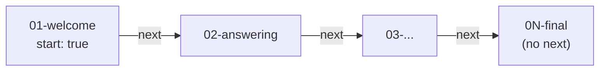

# Stages

A stage is a single puzzle within a [campaign](campaigns.md): one Markdown
file with frontmatter for its answer, hints, difficulty, and position in the
chain.

## The stage chain

Stages in a campaign must form a single linear chain: exactly one stage
marked `start: true`, each stage linking to the next via `next`, with no
cycles and no orphans.



## Answers

The `answer` is never shipped in clear text, only its trimmed, lowercased
SHA-256 hash reaches the client for in-browser checking.

To publish a campaign's source without revealing solutions, drop `answer`
and supply `answer_sha256` instead: the SHA-256 hex digest of the trimmed,
lowercased answer (the same value `answer` would produce). A stage may carry
either field, both, or neither. Neither is valid for informational stages
that only link `next`. When both are present, the plaintext `answer` wins and
a stale `answer_sha256` is logged as a build warning. A malformed
`answer_sha256` (not 64 lowercase hex characters) fails the build so a stage
never ships silently unsolvable.

## Hints

Hints are ordered and timed: each one becomes click-to-reveal after
`wait_seconds` of the player being on the stage. See
[Frontmatter](#frontmatter) below for the exact shape.

## Difficulty

Stage `difficulty` is required and must be an integer from 1 to 5, the
build fails otherwise. (Campaign-level `difficulty` is an optional,
unconstrained indicator.)

## Frontmatter

`campaigns/<dir>/stages/<file>.md`:

```yaml
---
title: Welcome                  # required
author: alice                   # required
difficulty: 1                   # required, 1–5
slug: welcome                   # optional, derived from filename
tags: [intro, warmup]           # optional
eta_minutes: 5                  # optional time estimate
theme: dark                     # optional override (stage > campaign > global)
start: true                     # marks the campaign entry point (exactly one)
next: answering                 # slug of the next stage (omit on last)
answer: 42                      # expected solution; shipped as a SHA-256 hash
answer_sha256: 9c56...          # precomputed answer hash (ship without plaintext)
completion_message: Solved!     # shown on stage completion
inputs: [data.json]             # from inputs/; download chips + ref as inputs/<file>
assets: [diagram.png]           # from assets/; not listed; ref as assets/<file>
hints:                          # ordered, timed click-to-reveal hints
  - wait_seconds: 30
    text: Look at the headers.
  - wait_seconds: 120
    text: It's base64.
published_at: 2026-01-01T00:00:00Z
last_update_at: 2026-02-01T00:00:00Z
---
Markdown body of the puzzle…
```

| Field                 | Required | Notes                                                              |
|-----------------------|----------|------------------------------------------------------------------------|
| `title`               | yes      |                                                                        |
| `author`               | yes      |                                                                        |
| `difficulty`          | yes      | Integer 1–5; the build fails outside that range.                     |
| `slug`                | no       | Derived from the filename if omitted.                                 |
| `tags`                | no       |                                                                        |
| `eta_minutes`         | no       | Estimated time to solve.                                              |
| `theme`               | no       | Overrides campaign/global theme for this stage.                       |
| `start`               | no       | Marks the campaign's entry point, exactly one stage per campaign.     |
| `next`                | no       | Slug of the next stage; omit on the last stage in the chain.           |
| `answer`              | no*      | Plaintext expected answer; shipped to the client only as a SHA-256 hash. |
| `answer_sha256`       | no*      | Precomputed hash, for publishing source without the plaintext answer.   |
| `completion_message`  | no       | Shown when this stage is solved.                                       |
| `inputs`              | no       | Files from `inputs/`; rendered as download chips, referenced as `inputs/<file>`. |
| `assets`              | no       | Files from `assets/`; not listed in UI, referenced as `assets/<file>`.  |
| `hints`               | no       | Ordered list of `{wait_seconds, text}`, click-to-reveal after the wait. |
| `published_at`        | no       | RFC 3339 timestamp.                                                     |
| `last_update_at`      | no       | RFC 3339 timestamp.                                                     |

\* A stage may carry `answer`, `answer_sha256`, both, or neither. Neither is
valid for an informational stage that only links `next`. If both are
present, the plaintext `answer` wins and a stale `answer_sha256` is logged as
a build warning. A malformed `answer_sha256` (not 64 lowercase hex
characters) fails the build.
